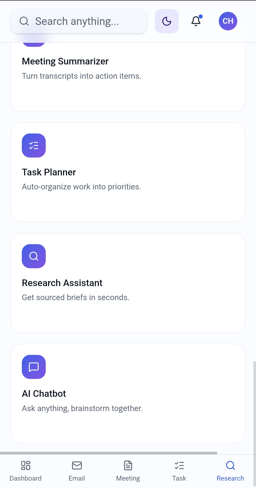
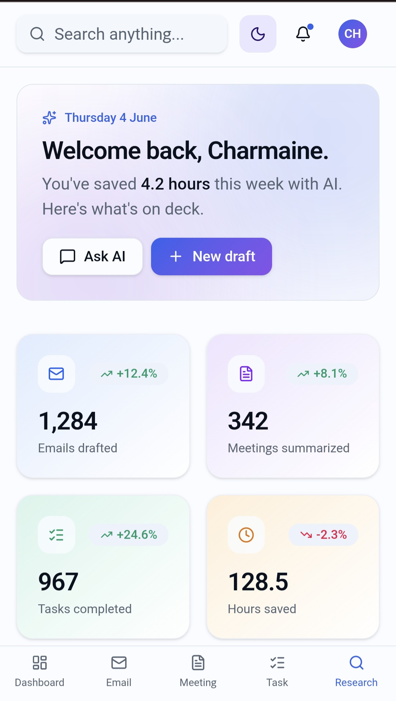
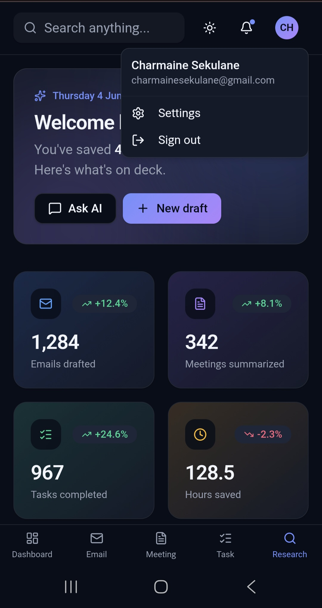
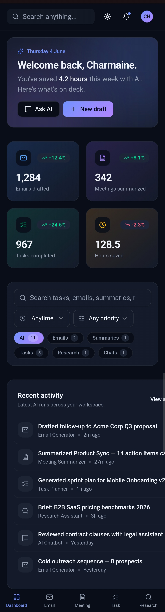
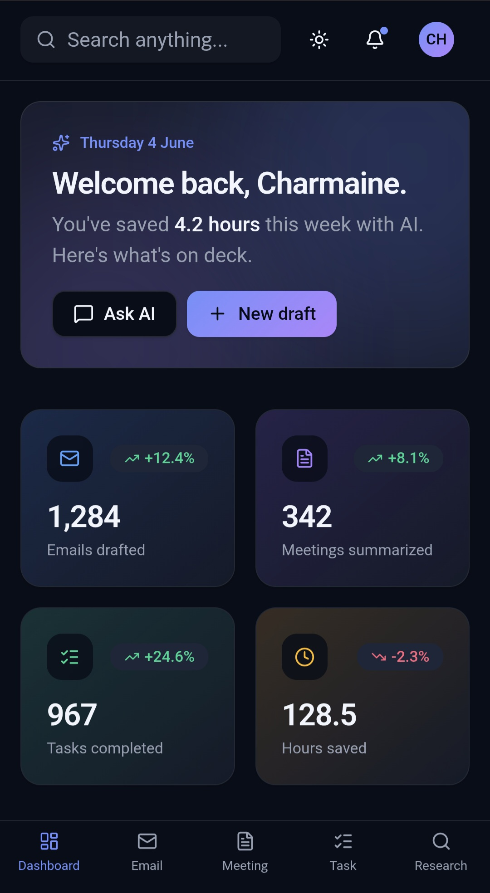

⁸# AI-productivty-suite
AI Workplace Productivity Assistant Pro

Project Overview

AI Workplace Productivity Assistant Pro is an AI-powered web application designed to help professionals automate common workplace tasks, improve productivity, and save time. The platform combines multiple AI-driven tools into a single dashboard, allowing users to generate professional emails, summarize meeting notes, plan tasks, conduct research, and interact with an AI assistant.

This project was developed as part of the AI Skills Acceleration Programme and demonstrates practical AI implementation, prompt engineering, modern UI/UX design, and responsible AI practices.

---

Problem Statement

Many professionals spend significant time performing repetitive administrative tasks such as drafting emails, organizing schedules, summarizing meeting notes, and researching information. These tasks can reduce productivity and take focus away from higher-value work.

AI Workplace Productivity Assistant Pro addresses this challenge by providing AI-powered tools that automate these activities and help users work more efficiently.

---

Features

Smart Email Generator

- Generates professional emails using AI
- Supports multiple tones:
  - Formal
  - Friendly
  - Professional
  - Persuasive
- Editable output
- Copy-to-clipboard functionality

Meeting Notes Summarizer

- Summarizes lengthy meeting notes
- Extracts key discussion points
- Identifies action items
- Highlights decisions and deadlines

AI Task Planner and Scheduler

- Creates daily and weekly task plans
- Prioritizes tasks based on urgency
- Improves time management
- Organizes workloads efficiently

AI Research Assistant

- Summarizes research topics
- Generates key insights
- Provides recommendations
- Highlights opportunities and risks

AI Workplace Chatbot

- Interactive AI assistant
- Answers workplace productivity questions
- Provides guidance and support
- Maintains conversational interaction

---

Tools and Technologies Used

- Lovable AI
- ChatGPT
- GitHub
- Artificial Intelligence (AI)
- Prompt Engineering
- Responsive Web Design

---

Prompt Engineering

The application uses carefully structured prompts to ensure accurate and useful AI-generated outputs. Prompt engineering techniques were applied to:

- Generate professional business emails
- Summarize meeting discussions
- Prioritize workplace tasks
- Produce research insights
- Facilitate intelligent chatbot interactions

---

User Interface and Design

The application includes:

- Modern SaaS-inspired dashboard
- Sidebar navigation
- Responsive design for desktop and mobile devices
- Professional layout and styling
- User-friendly input and output sections
- Editable AI-generated responses

---

Responsible AI Statement

This application promotes responsible AI usage.

Disclaimer: AI-generated content may occasionally contain inaccuracies or incomplete information. Users should review, verify, and validate all generated outputs before making business, academic, or professional decisions.

---

Project Outcomes

This project demonstrates:

- Practical AI implementation
- Real-world problem solving
- Effective prompt engineering
- Modern UI/UX design
- Productivity enhancement through AI
- Responsible AI practices

---

Future Improvements

Potential future enhancements include:

- Calendar integration
- Team collaboration features
- Voice-to-text meeting transcription
- Advanced analytics dashboard
- Multi-language support
- Cloud data storage

---

Author

Developed as part of the AI Skills Acceleration Programme (ASA 5).

---

Live Application

https://preview--taskwise-ai-assist.lovable.app/?__lovable_token=eyJhbGciOiJSUzI1NiIsInR5cCI6IkpXVCJ9%2EeyJ1c2VyX2lkIjoiWjNCT3pHZlBBVlhtS0VwWFpDQXNja0llVVIzMiIsInByb2plY3RfaWQiOiI3MjAwZjE1Yy0zNWQ0LTQyYjktYWFlYi1kZDQ5YjhiYTZiMjUiLCJhY2Nlc3NfdHlwZSI6InByb2plY3QiLCJpc3MiOiJsb3ZhYmxlLWFwaSIsInN1YiI6IjcyMDBmMTVjLTM1ZDQtNDJiOS1hYWViLWRkNDliOGJhNmIyNSIsImF1ZCI6WyJsb3ZhYmxlLWFwcCJdLCJleHAiOjE3ODEyMTU5ODUsIm5iZiI6MTc4MDYxMTE4NSwiaWF0IjoxNzgwNjExMTg1fQ%2EJmB5Q_QC8d_1J3a3A5aQzdrObDQk5UeQJHhGJHSMYKp6evC-Qpa3xpIQ-V8j6H4Tm63fm1B5Sw5lSST-96trgGon53bJeFwMEgKgoqHwHcE5scJFWCD9vqGG1ecoepRst52kL36e6_UVDpMrFwN9gbO6KY3ATxzYHJM2i_ym0gUhDKygmT4QYuF8xzXVfYXipotMiqwYtRp_MwmXJbf7yClzleLgREcQiIZWmc1HJhGTCjvCGLZdXS4Hu7myIHGoSNE_dpULZE2YnM1ECGyZm7SolLlV6FWqnxp4pEF2-LKaYhhyT-zDrY-oR1ANh9oH2S2Qo-wsm-brxtAzH9mRijsxglqBYyEaB6aNcElQg7-pVJMMpGD_OgK7ygJitfw0akjXNBYmidr1UcW_eSsvixdspe33Mk4MDxNvwgwX-unggz_eIol64k6v3YLFFxPpVezYRqAhx7w_0VEC8dzErx2Fw2LR5Y2Kr8fGC_DVKwp7flZxMB7jADPnroW9nXQVMWC45a3oc7o4uKQHuJe-lO9WJu9ga2WsWBIlXKaMibxRCR1mgnQHqVCGSCXY-GzCNS5HvBESzVIIZfnvV4N97RK_-w25BjHazoQev53baRdOQNJcusmt2Nj1joCeZW6M6rcRmSQgp_j8KRorT12AlkmKeOjW_Zlg680vIyUxkX4

---

S## Screenshots

### Dashboard

### Meeting Notes Summarizer

### Task Planner

### Research Assistant

### AI Chatbot

